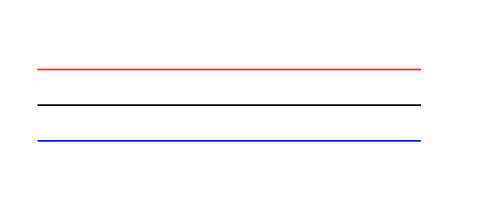
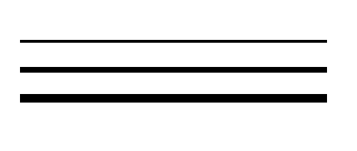
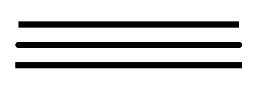
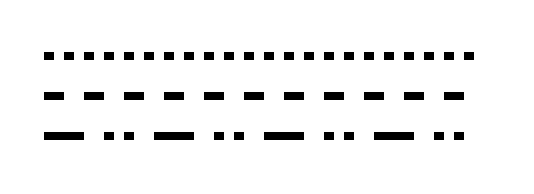
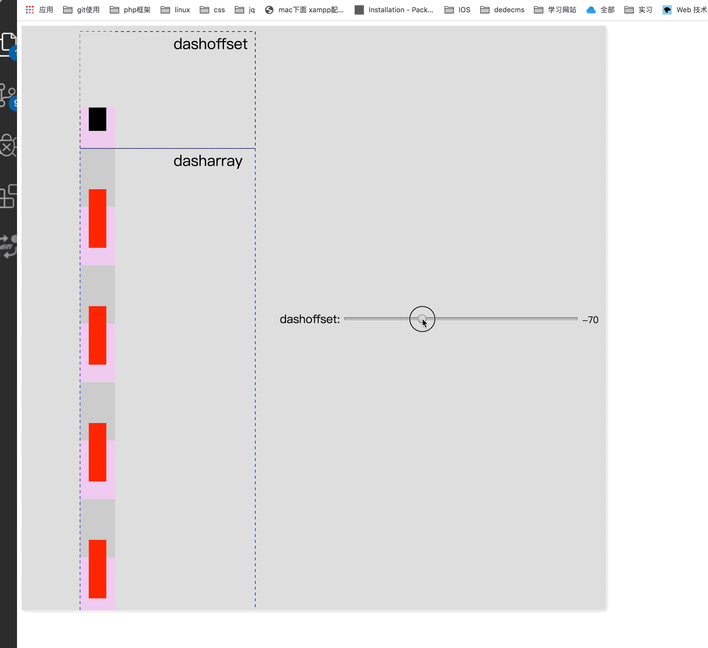

## svg描边动画

### svg初了解
svg中有着基本图形（rect、circle、ellipse、line、polyline、polygon），路径（path），和文本（text等）。这些标签统一包含在一对```<svg></svg>```标签中，其中svg标签需要标记```xmlns```属性来方便文档识别。不同标签有着各自的属性，这里不再赘述，有需要可以直接在[demo](./demo/basic.html)中查看。

### stroke属性
stroke属性描述了一个图形的边框的相关属性，以下是几种常用的stroke属性
1. stroke
描述边框的颜色
```
<svg xmlns="http://www.w3.org/2000/svg" version="1.1">
  <g fill="none">
    <path stroke="red" d="M5 20 l215 0" />
    <path stroke="black" d="M5 40 l215 0" />
    <path stroke="blue" d="M5 60 l215 0" />
  </g>
</svg>
```


2. stroke-width
顾名思义，此属性控制边框的宽度（在线条图形中，可以视为线条宽度）。

```
<svg xmlns="http://www.w3.org/2000/svg" version="1.1">
  <g fill="none" stroke="black">
    <path stroke-width="2" d="M5 20 l215 0" />
    <path stroke-width="4" d="M5 40 l215 0" />
    <path stroke-width="6" d="M5 60 l215 0" />
  </g>
</svg>
```


3. stroke-linecap
stroke-linecap用来控制不同路径的终点样式

```
<svg xmlns="http://www.w3.org/2000/svg" version="1.1">
  <g fill="none" stroke="black" stroke-width="6">
    <path stroke-linecap="butt" d="M5 20 l215 0" />
    <path stroke-linecap="round" d="M5 40 l215 0" />
    <path stroke-linecap="square" d="M5 60 l215 0" />
  </g>
</svg>
```


4. stroke-dasharray
stroke-dasharray用来创建虚线，也是svg描边动画中的重要属性，需要注意的是当参数为奇数（a）个时，会将```a+a```作为运行的参数,每两个参数为一组，代表实线和虚线的长度。
```
<svg xmlns="http://www.w3.org/2000/svg" version="1.1">
  <g fill="none" stroke="black" stroke-width="4">
    <path stroke-dasharray="5,5" d="M5 20 l215 0" />
    <path stroke-dasharray="10,10" d="M5 40 l215 0" />
    <path stroke-dasharray="20,10,5,5,5,10" d="M5 60 l215 0" />
  </g>
</svg>
```


5. storke-dashoffset
线段的偏移度，可以当做一条直线在可视区域内的平移。类似于下图

点击这里查看[demo](./demo/stroke-dashoffset.html)

### 实现svg描边动画
除了上面的stroke属性，实现svg描边动画还需要```getTotalLength```和```requestAnimationFrame```。
1. getTotalLength: 用来获取svg路径的长度，在svg1.1中仅支持获取path的长度，在svg2中支持所有的图形路径长度。
2. requestAnimationFrame: 根据显示器刷新分辨率来执行动画函数。

#### svg描边动画基本步骤
1. 首先通过getTotalLength获取图形的总长度L。
2. 设定图形的stroke-dasharray间隔为L。
3. 隐藏：设定图形的stroke-dashoffset为L。
4. 设定动画总时间T（秒*分辨率）。
5. 根据总时间计算每次显示器刷新修改的路径（此处假定为匀速，当然也可以添加曲率速度函数来控制）l = L/T。
6. 在requestAnimationFrame中改变stroke-dashoffset的值，当前值每次减去l直至小于0。
7. 根据实际情况来确定stroke-dashoffset小于0时添加的dom样式。   

以上是使用js执行时的基本步骤，同样的，使用css3的animation来控制动画也是一样的。
这里是使用[js](./demo/recycle-js.html)和[css3](./demo/recycle-css3.html)简单demo

### svg工具
 * [vectr](https://vectr.com/)：在线svg绘制。[demo]
 * [SVGOMG](https://jakearchibald.github.io/svgomg/)：svg压缩工具

### svg相关库
 * [vivus](http://maxwellito.github.io/vivus/)
 * [walkway](https://github.com/ConnorAtherton/walkway) -- [PS4-demo](https://www.polygon.com/a/ps4-review)

### 参考文档
 * [You Too Can Animate: SVG Line Animation](https://dev.to/oppnheimer/you-too-can-animate-svg-line-animation-jgm)
 * [How SVG Line Animation Works](https://css-tricks.com/svg-line-animation-works/)
